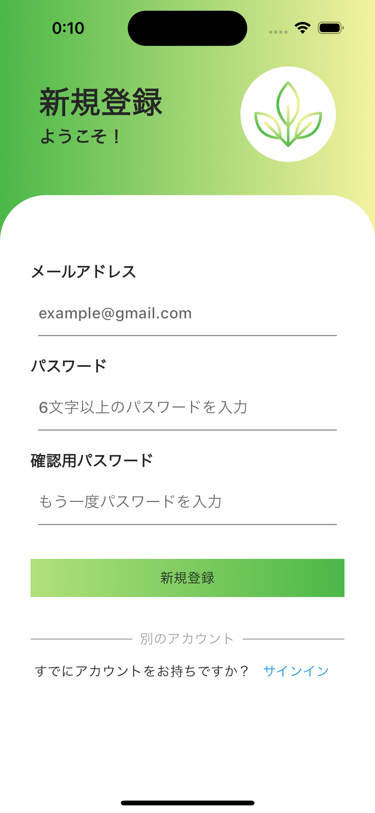
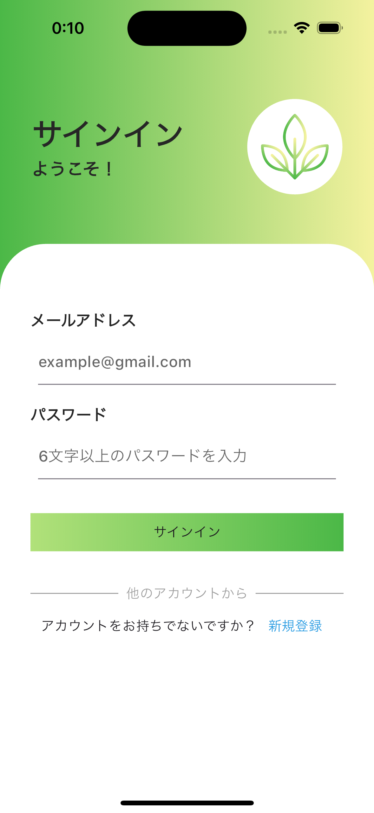

# Serene Track

 

## アプリについて
 

### Serene Trackは、仕事・作業にのめり込んでしまい、自ら休息をとれない人に向けた健康管理アプリです。

  

このアプリを作ったきっかけは

 - まわりの人が長生きしてほしい

 - ITエンジニアの健康問題を解決

 - 自分の健康意識をあげたい

 - ヘルスケアIT事業に興味があり、まずは自分で健康管理アプリを作ってみたいと思った

 
 
 
 
 

***
## イメージ画像・動画

| 新規登録画面 | サインイン画面 |
| :---: | :---: |
|   |   |

| タスク画面 | モニタリング画面 | アカウント画面 |
| :---: | :---: | :---: |
| <video src="./assets/videos/task_screen_video.mov" width="200"> | <video src="./assets/videos/montring_screen_video.mov" width="200"> | <video src="./assets/videos/account_screen_video.mov" width="200"> |

 
 
 
 
 

***
## 主な機能

- ### 🔑 認証画面

  - #### サインアップ機能

  - #### サインイン機能

    ⇨ メールアドレスとパスワードを使用してアカウントを作成

  - #### バリデーション機能

    ⇨ メールアドレスが有効な形式でない場合、またパスワードが6文字未満である場合などに、正しい入力値を求めるようバリデーション処理を実装

 
 

- ### 📝 タスク画面

  - #### タスク追加・編集・削除機能

  - #### タスク進捗記録機能

  - #### 通知機能(リマインド機能)

   
   

- ### ⏰ モニタリング画面

  - #### タイマー機能

  - #### サウンド機能

  - #### 休憩促進機能

  - #### 休憩達成をお祝いする機能

  - #### バイブレーション機能

   
   

- ### 👤 アカウント画面

  - #### ユーザー情報設定機能

  - #### カテゴリー別タスク達成率表示機能

  - #### 健康データ表示機能

    ⇨ ヘルスケアアプリからデータを自動取得(アプリと連携済みの場合)

  - #### 通知設定削除機能

  - #### サインアウト機能

  - #### アカウント削除機能

 
 
 
 
 

***
## 画面遷移図

 

 
 

***
## こだわったところ

- ### 📝 タスク画面

  - #### カテゴリー別(すべて・運動・睡眠・仕事)にタブ分けしてタスク表示

  - #### 編集モードでタスク編集をわかりやすくした

  - #### 通知ボタンをタップすると、通知設定しているタスク一覧を確認できる画面に遷移するようにした

 
 

- ### ⏰ モニタリング画面

  - #### 時間設定をあえて変更できないようにすることで、ユーザーにデフォルトの1時間タイマーを使ってもらい、作業・仕事中の定期的な休憩を促すようにした

  - #### 進捗バーでタイマーの進捗がわかるようにした

  - #### 休憩達成時に、紙吹雪でお祝いしてくれるパッケージを使用して、UXの向上を考えた

 
 

- ### 👤 アカウント画面

  - #### タスクの達成率をカテゴリー別に円グラフで表示しデータを可視化した

  - #### ヘルスケアアプリから取得してきたデータが表示されている部分のUIは、ヘルスケアアプリっぽいUIに寄せてデータの取得先を自然に認識できるようにした

  - #### 過去1週間分の歩数情報、睡眠時間のデータを棒グラフで表示しデータを可視化した

  - #### 過去1週間分の歩数情報、睡眠時間の平均値をカードウィジェットで表示させた

 
 

- ### 全体的に

  - #### 確認ダイアログを頻繁に出すことで、ユーザーの誤作動を防ぐ仕組みを増やした

  - #### 緑、黄色などの色をカラーイメージに設定し、生理的・心理的なリラックス効果を与えるUIを意識した

 
 
 
 
 

***

## 実装中に意識していること

 

- #### ファイル名・変数名が適切かどうか

- #### ディレクトリ構造は正しいか
  - MVVM+Repositoryパターンにのっとって実装 
  - 参考にした記事: [【Flutter】そのディレクトリ構成は恋される](https://zenn.dev/web_tips/articles/530d02aaf90400)

- #### 共同開発を意識して、わかりやすいコメントを残す

- #### コンポーネントの共通化して全体のコードを量を減らす

- #### 大きなデータの取得回数をなるべく減らす

 
 
 
 
 

***

## 今後の展望

 

- #### AIを使ってチャットボットを作成し、個人の健康データを元にアドバイスを提供する機能

- #### 健康に関する記事や動画を閲覧できる機能

- #### このアプリのチュートリアル

- #### クリーンアーキテクチャで大規模開発向けに

 
 
 
 
 

***

## バックエンド

 

#### 以下のリンクからバックエンドのGithubリポジトリを参照ください
#### ↪︎ [serene_track_backend](https://github.com/kiichi7580/serene_track_backend)

 
 
 
 
 

***

## 使ったパッケージ

 

- ### UI関連
  - tab_container:
  - flutter_launcher_icons:
  - flutter_native_splash:
  - url_launcher:
  - fl_chart:
  - flutter_slidable:
  - flutter_datetime_picker_plus:
  - line_icons:
  - confetti:
 

- ### 状態管理

  - flutter_riverpod:

 

- ### ビルド関連

  - build_runner:
  - json_serializable:

 

- ### 通信関連

  - dio:

 

- ### データ保存関連

  #### ローカル
  - shared_preferences:

 

- ### データ処理関連

  - freezed:
  - freezed_annotation:
  - image_picker:
  - intl:
  - json_annotation:
  - riverpod_annotation:
  - enum_to_string:

 

- ### ヘルスケアアプリ連携

 - health:

 

- ### ナビゲーション

 - go_router:

 

- ### サウンド

  - audioplayers:

 

- ### バイブレーション

  - flutter_vibrate:

 

- ### 通知

  - permission_handler:
  - flutter_local_notifications:

 